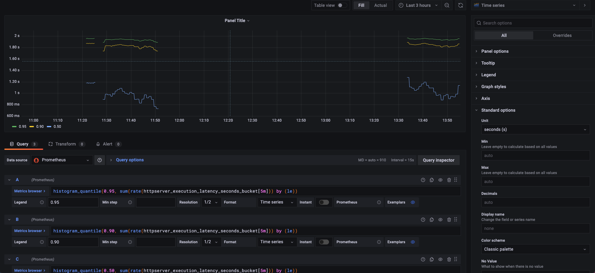

### 作业要求
1. 为 HTTPServer 添加 0-2 秒的随机延时
2. 为 HTTPServer 项目添加延时 Metric
3. 将 HTTPServer 部署至测试集群，并完成 Prometheus 配置
4. 从 Promethus 界面中查询延时指标数据
5. （可选）创建一个 Grafana Dashboard 展现延时分配情况

### 在代码中添加/metrices 接口，添加随机延迟，添加随机延迟metrics
[代码地址main.go](https://github.com/sunzhencode/golang/blob/master/http01/main.go)

### 提交代码并部署Deployment
```yaml
# 需要添加promentheus自动发现配置
      annotations:
        prometheus.io/scrape: "true"
        prometheus.io/port: "80"
# 声明容器端口否则无法自动发现
          ports:
            - containerPort: 80
```

### 部署loki和Prometheus
```bash
helm repo add grafana https://grafana.github.io/helm-charts
helm pull grafana/loki-stack
tar -xvf loki-stack-2.4.1.tgz
sed -i s#rbac.authorization.k8s.io/v1beta1#rbac.authorization.k8s.io/v1#g *.yaml
helm upgrade --install loki ./loki-stack --set grafana.enabled=true,prometheus.enabled=true,prometheus.alertmanager.persistentVolume.enabled=false,prometheus.server.persistentVolume.enabled=false -n loki

这个里面的Prometheus有一些默认配置,其中有配置好的自动发现 含有annotations 为 prometheus.io/scrape: "true" 的pod
部署完成后在prometheus target中可以查看到httpserver pod,已经进行指标收集
```

### 创建grafana dashboard
```bash
PromQL:  histogram_quantile(0.95, sum(rate(httpserver_execution_latency_seconds_bucket[5m])) by (le))
```

### 显示效果
